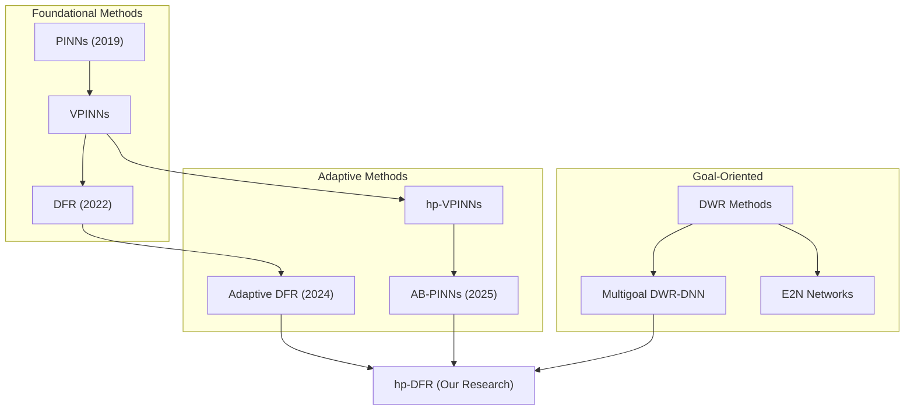

# Literature Review

This document surveys recent advances in adaptive hp-refinement and goal-oriented error estimation for solving PDEs using neural networks. Last updated: December 2025.

## Overview

Our research combines three key areas:
1. **Deep Fourier Residual (DFR) methods** - variational PINNs with $H^{-1}$ dual norm loss
2. **Adaptive hp-refinement** - domain decomposition with local networks
3. **Goal-oriented error estimation** - dual-weighted residual methods

---

## 1. Deep Fourier Residual Methods

### 1.1 Original DFR Method (2022)

The foundational work by Taylor, Pardo, and Muga establishes the Deep Fourier Residual method.

**Key Contribution**: Uses Discrete Sine/Cosine Transform to compute the $H^{-1}$ dual norm of the PDE residual, providing an error-equivalent loss function.

**Advantages**:
- Loss function is equivalent to energy norm error for well-posed problems
- Works for solutions lacking $H^2$ regularity where PINNs fail
- Theoretically grounded error-loss relationship

**Limitations**:
- Restricted to rectangular/cuboid domains
- Curse of dimensionality: requires $O(N^d)$ Fourier modes
- Uniform refinement everywhere

**Source**: [A Deep Fourier Residual Method for solving PDEs using Neural Networks](https://arxiv.org/abs/2210.14129) (arXiv:2210.14129)

### 1.2 Adaptive DFR with Domain Decomposition (2024)

Taylor et al. extended DFR to handle more general domains through overlapping domain decomposition.

**Key Contributions**:
- Extends DFR to polygonal domains (not just rectangles)
- Introduces Dofler marking algorithm for adaptive test space refinement
- Maintains error-loss equivalence under reasonable assumptions

**Methodology**:
- Decomposes domain into overlapping rectangles
- Computes local DFR losses on each subdomain
- Uses residual-based indicators for adaptive refinement

**Results**: Significant improvements over classical DFR using substantially lower-dimensional test function spaces, particularly for singular solution approximation.

**Source**: [Adaptive Deep Fourier Residual method via overlapping domain decomposition](https://arxiv.org/abs/2401.04663) (arXiv:2401.04663)

**Code**: [GitHub - Mathmode/Adaptive-Deep-Fourier-Residual](https://github.com/Mathmode/Adaptive-Deep-Fourier-Residual-method-via-overlapping-domain-decomposition)

### 1.3 DFR for Maxwell's Equations (2024)

Extension of DFR to electromagnetic problems with $H(\text{curl})$ test function spaces.

**Key Insight**: The DFR framework generalizes beyond scalar problems to vector-valued PDEs requiring different function spaces.

**Source**: [Deep Fourier Residual method for solving time-harmonic Maxwell's equations](https://www.sciencedirect.com/science/article/abs/pii/S0021999124008714) (ScienceDirect)

---

## 2. Adaptive and hp-Refinement Methods

### 2.1 hp-VPINNs (2021)

Kharazmi et al. introduced hp-Variational Physics-Informed Neural Networks, combining domain decomposition with variational formulations.

**Key Features**:
- Domain decomposition (h-refinement) with dynamic mesh resolution
- Integration-by-parts reduces order of differential operators
- Works efficiently with rough solutions (singularities, steep gradients)
- Refinement based on point-wise residual values

**Applications**: Advection-diffusion (1D), Poisson equation (1D-2D)

**Source**: [hp-VPINNs: Variational physics-informed neural networks with domain decomposition](https://www.sciencedirect.com/science/article/abs/pii/S0045782520307325) (ScienceDirect)

### 2.2 AB-PINNs: Adaptive-Basis PINNs (2025)

A novel approach where subdomains dynamically adapt during training.

**Key Innovation**: Unlike static domain decomposition, AB-PINNs modify decomposition on-the-fly throughout training by introducing new subdomains in regions of high residual loss.

**Advantages**:
- Inspired by classical adaptive mesh refinement
- Different subdomains can specialize for different solution scales
- Helps prevent convergence to undesirable local minima
- Reduces reliance on extensive hyperparameter optimization

**Results**: Effective for complex multiscale PDEs.

**Source**: [AB-PINNs: Adaptive-Basis Physics-Informed Neural Networks for Residual-Driven Domain Decomposition](https://arxiv.org/abs/2510.08924) (arXiv:2510.08924)

### 2.3 AS-PINNs: Adversarial Self-Adaptive PINNs (2025)

Addresses high-order problems with discontinuities through adversarial and self-adaptive domain decomposition.

**Key Insight**: Analogous to adaptive mesh refinement in FEM, but current PINN adaptivity focuses mainly on sampling/weighting and lacks adaptive domain decomposition capability.

**Source**: [Adversarial and self-adaptive domain decomposition physics-informed neural networks](https://www.sciencedirect.com/science/article/abs/pii/S0952197625001563) (ScienceDirect)

### 2.4 Adaptive Sampling Methods

Several recent methods address adaptive collocation point distribution:

| Method | Approach | Reference |
|--------|----------|-----------|
| **RAR** | Residual-based Adaptive Refinement | Wu et al. |
| **RAD** | Residual-based Adaptive Distribution | Wu et al. |
| **AAS** | Adversarial Adaptive Sampling with optimal transport | Tang et al. (2024) |

**RAR/RAD** generate additional points in high-residual regions or adjust distributions based on loss function approximation.

**AAS** integrates PINNs with optimal transport theory, using deep generative models to adjust sample distributions.

---

## 3. Goal-Oriented Error Estimation

### 3.1 Dual-Weighted Residual (DWR) Methods

The classical DWR framework uses adjoint solutions to localize errors with respect to quantities of interest (QoI).

**Key Formula**: For a QoI $J(u)$, the error satisfies:
$$J(u) - J(u_h) \approx \langle R(u_h), z - z_h \rangle$$
where $z$ is the adjoint solution and $R$ is the residual.

**Relevance to hp-DFR**: DWR provides the theoretical foundation for focusing computational effort on regions affecting the QoI most.

### 3.2 Multigoal-Oriented DWR with DNNs (2021-2025)

Endtmayer et al. explored using neural networks to compute adjoints for goal-oriented error estimation.

**Key Findings**:
- Neural networks can approximate adjoint solutions with 2-3 hidden layers
- NN-computed adjoints yield excellent approximations for DWR error estimates
- May serve as alternative to FEM adjoints when degrees of freedom are high
- Superior approximation of QoI even with relatively less training data

**Methodology**:
- Solve both primal and adjoint problems with neural networks
- Use error localization for multiple goal functionals
- Handles nonlinear PDEs and nonlinear goal functionals

**Source**: [Multigoal-oriented dual-weighted-residual error estimation using deep neural networks](https://arxiv.org/abs/2112.11360) (arXiv:2112.11360)

**Recent Update (2025)**: Published in [Machine Learning for Computational Science and Engineering](https://link.springer.com/article/10.1007/s44379-025-00012-4)

### 3.3 Neural Network Guided DWR (2022)

Explicit work on using feedforward NNs to compute adjoints within traditional FEM frameworks.

**Approach**:
1. Solve adjoint PDE with neural networks (strong formulation)
2. Project NN solution into FEM space
3. Use projected adjoint for DWR error estimation

**Conclusion**: Neural networks offer an alternative for computing adjoint sensitivities in goal-oriented estimators.

**Source**: [Neural network guided adjoint computations in dual weighted residual error estimation](https://link.springer.com/article/10.1007/s42452-022-04938-9) (Springer)

### 3.4 Error Estimation Networks (E2N)

Data-driven goal-oriented mesh adaptation replacing expensive error estimation with trained neural networks.

**Key Innovation**: Element-by-element construction using local mesh geometry and physics parameters as inputs, avoiding enriched space construction entirely.

**Source**: [E2N: Error Estimation Networks for Goal-Oriented Mesh Adaptation](https://api.deepai.org/publication/e2n-error-estimation-networks-for-goal-oriented-mesh-adaptation) (DeepAI)

---

## 4. A Posteriori Error Estimation for PINNs

### 4.1 Certified Machine Learning (2022-2025)

Rigorous a posteriori error bounds for PINNs that can be computed without knowing the true solution.

**Key Result**: Upper bounds on PINN prediction error using only a priori information about the underlying dynamical system.

**Applications**: Transport equation, heat equation, Navier-Stokes, Klein-Gordon equation.

**Sources**:
- [Certified machine learning: A posteriori error estimation for physics-informed neural networks](https://arxiv.org/abs/2203.17055) (arXiv:2203.17055)
- [Rigorous a Posteriori Error Bounds for PDE-Defined PINNs](https://ieeexplore.ieee.org/document/10337737/) (IEEE, 2024)

### 4.2 A Posteriori Certification (2025)

Rigorous lower and upper bounds for PINN approximations via Riesz representations.

**Methodology**: Efficiently compute Riesz representations of suitable extensions/restrictions of PINN residuals to geometrically simpler domains.

**Coverage**: Elliptic and parabolic problems with proven error bounds.

**Source**: [A posteriori Certification for physics-informed neural networks](https://arxiv.org/html/2502.20336) (arXiv, 2025)

### 4.3 Unified Error Analysis Framework (2024)

A priori and a posteriori error estimates for PINNs solving linear PDEs.

**Key Insight**: The $L^2$ penalty approach for initial/boundary conditions weakens the norm of error decay.

**Coverage**: Elliptic (primal and mixed form), elasticity, parabolic, hyperbolic, Stokes equations.

**Source**: [A Unified Framework for the Error Analysis of Physics-Informed Neural Networks](https://arxiv.org/abs/2311.00529) (arXiv:2311.00529)

---

## 5. Curse of Dimensionality Solutions

### 5.1 Stochastic Dimension Gradient Descent (SDGD)

**Key Innovation**: Decomposes gradient into dimensional pieces, randomly sampling subsets per iteration.

**Results**:
- Solves HJB and Schrodinger equations in tens of thousands of dimensions on single GPU
- 1,000 dimensions in < 1 hour
- 100,000 dimensions in 12 hours

**Source**: [Tackling the curse of dimensionality with physics-informed neural networks](https://dl.acm.org/doi/10.1016/j.neunet.2024.106369) (Neural Networks, 2024)

### 5.2 Tensor Neural Networks

Combines tensor structures with a posteriori error estimators for high-dimensional boundary value problems.

**Advantage**: High-dimensional integrations computed with high accuracy and efficiency.

### 5.3 Sparse Grid Methods (Classical)

The foundational work on sparse grids provides the mathematical basis for our sparse Fourier approach.

**Key Reference**: Bungartz, H.J., Griebel, M. (2004). Sparse grids. Acta Numerica, 13, 147-269.

**Complexity Reduction**: From $O(N^d)$ to $O(N(\log N)^{d-1})$ for functions in mixed Sobolev spaces.

---

## 6. Additional Relevant Work

### 6.1 Adaptive PINNs Survey (2025)

Comprehensive survey on transfer learning and meta-learning approaches to address PINN limitations.

**Key Limitations Addressed**:
- Convergence challenges in training
- Need to re-optimize when PDE parameters change

**Source**: [Adaptive Physics-informed Neural Networks](https://arxiv.org/abs/2503.18181) (TMLR, 2025)

### 6.2 Sensitivity Analysis in PINNs (2024)

SA-PINN: Local sensitivity analysis via loss function regularization.

**Method**: Add term representing derivative of loss with respect to parameter of interest, obtaining solution and sensitivity simultaneously.

**Source**: [Sensitivity analysis using Physics-informed neural networks](https://www.sciencedirect.com/science/article/abs/pii/S0952197624009229) (ScienceDirect)

### 6.3 Comprehensive Reviews

| Review | Focus | Source |
|--------|-------|--------|
| Cuomo et al. (2022) | Scientific ML with PINNs | [Journal of Scientific Computing](https://link.springer.com/article/10.1007/s10915-022-01939-z) |
| Liu et al. (2025) | PINNs for PDE problems | [Artificial Intelligence Review](https://link.springer.com/article/10.1007/s10462-025-11322-7) |
| Mishra & Molinaro (2024) | Numerical analysis of PINNs | [Acta Numerica](https://www.cambridge.org/core/journals/acta-numerica/article/numerical-analysis-of-physicsinformed-neural-networks-and-related-models-in-physicsinformed-machine-learning/A059C6E13478F0F7C70EC7C976716F9F) |
| ML + Domain Decomposition | Survey | [Computational Science and Engineering](https://link.springer.com/article/10.1007/s44207-024-00003-y) |

---

## 7. Summary Table

| Topic | Key Methods | Status | Relevance to hp-DFR |
|-------|-------------|--------|---------------------|
| **DFR Extensions** | Adaptive DFR, DFR-Maxwell | Active (2024) | Direct foundation |
| **hp-Refinement** | hp-VPINNs, AB-PINNs | Active (2025) | Architecture design |
| **Goal-Oriented** | DWR-DNN, E2N | Active (2025) | Error estimation |
| **A Posteriori** | Certified ML | Active (2025) | Validation framework |
| **High-Dimensional** | SDGD, Tensor NN | Active (2024) | Curse of dimensionality |

---

## 8. Research Gaps Identified

Based on this literature review, we identify the following gaps that our hp-DFR research addresses:

### Gap 1: No Combined hp-DFR Framework
While Adaptive DFR (domain decomposition) and hp-VPINNs exist separately, no work combines:
- DFR-style dual norm losses
- hp-adaptive refinement
- Sparse Fourier methods

### Gap 2: Goal-Oriented DFR
Existing goal-oriented methods use standard PINN losses or FEM. No work applies:
- DWR to DFR-style losses
- Adjoint-based refinement indicators for Fourier methods

### Gap 3: Sparse Tensor DFR
While sparse grid methods are well-established in classical numerics, application to:
- DFR loss computation
- Adaptive mode selection
remains unexplored.

### Gap 4: Theoretical Analysis
Need for:
- Error-loss equivalence proofs with sparse modes
- Stability analysis for coupled multi-network DFR
- Convergence rates for goal-oriented DFR

---

## References

### Primary Sources (DFR)

1. Taylor, J.M., Pardo, D., Muga, I. (2022). A Deep Fourier Residual Method for solving PDEs using Neural Networks. [arXiv:2210.14129](https://arxiv.org/abs/2210.14129)

2. Taylor, J.M., et al. (2024). Adaptive Deep Fourier Residual method via overlapping domain decomposition. [arXiv:2401.04663](https://arxiv.org/abs/2401.04663)

### Adaptive Methods

3. Kharazmi, E., Zhang, Z., Karniadakis, G.E. (2021). hp-VPINNs: Variational physics-informed neural networks with domain decomposition. [ScienceDirect](https://www.sciencedirect.com/science/article/abs/pii/S0045782520307325)

4. Burrows, L., Chen, W., Sherif, M. (2025). AB-PINNs: Adaptive-Basis Physics-Informed Neural Networks. [arXiv:2510.08924](https://arxiv.org/abs/2510.08924)

### Goal-Oriented Error Estimation

5. Endtmayer, B., Langer, U., Wick, T. (2021). Multigoal-oriented dual-weighted-residual error estimation using deep neural networks. [arXiv:2112.11360](https://arxiv.org/abs/2112.11360)

6. Kakranian, M., Rasooli, M. (2022). Neural network guided adjoint computations in dual weighted residual error estimation. [Springer](https://link.springer.com/article/10.1007/s42452-022-04938-9)

### A Posteriori Estimation

7. De Ryck, T., Mishra, S. (2022). Certified machine learning: A posteriori error estimation for physics-informed neural networks. [arXiv:2203.17055](https://arxiv.org/abs/2203.17055)

8. Zhang, D., Chen, Y. (2024). Rigorous a Posteriori Error Bounds for PDE-Defined PINNs. [IEEE](https://ieeexplore.ieee.org/document/10337737/)

### High-Dimensional Methods

9. Hu, Z., et al. (2024). Tackling the curse of dimensionality with physics-informed neural networks. [Neural Networks](https://dl.acm.org/doi/10.1016/j.neunet.2024.106369)

### Classical References

10. Bungartz, H.J., Griebel, M. (2004). Sparse grids. Acta Numerica, 13, 147-269.

11. Becker, R., Rannacher, R. (2001). An optimal control approach to a posteriori error estimation in finite element methods. Acta Numerica, 10, 1-102.

12. Schwab, C. (1998). p- and hp-Finite Element Methods. Oxford University Press.
