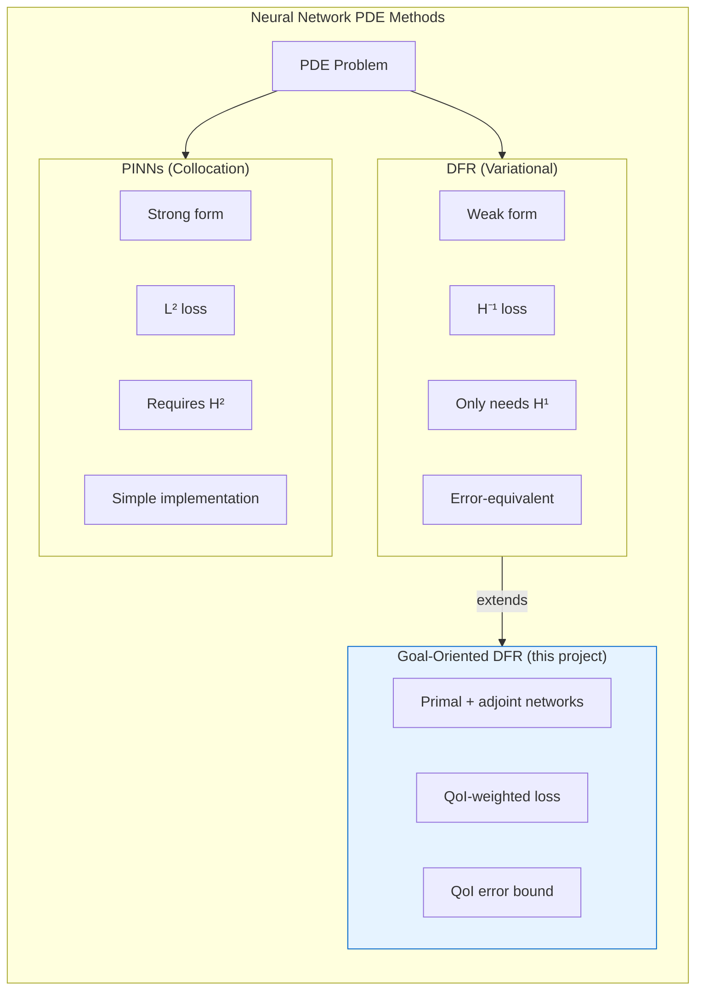

# Method Comparison

This page compares PINNs and DFR across different problem types and provides guidance on when to use each method.



## Summary Table

| Feature                    | PINNs (Collocation) | DFR (Variational)  |
| -------------------------- | ------------------- | ------------------ |
| **Formulation**            | Strong              | Weak               |
| **Loss Function**          | $L^2$ residual      | $H^{-1}$ residual  |
| **Integration**            | Random collocation  | Fourier quadrature |
| **BC Enforcement**         | Penalty term        | Cutoff layer       |
| **Regularity Required**    | $H^2$               | $H^1$              |
| **Error-Loss Correlation** | Weak                | Strong             |
| **Domain Support**         | General             | Rectangular        |
| **Implementation**         | Simpler             | More complex       |

## Benchmark Results

The original paper compares both methods on several test problems:

### Model Problem 1: Smooth Solution

$$
u(x) = \sin(2x), \quad x \in [0, \pi]
$$

**Result**: Both methods perform comparably for smooth, regular solutions.

### Model Problem 2: Large Gradients (Arctan)

$$
u(x) = \arctan(100(x - 0.5))
$$

**Result**: DFR significantly outperforms PINNs. The large forcing term in $L^2$ creates optimization difficulties for PINNs.

> This project's own `arctan` benchmark uses a gentler steepness $k = 8$ with an affine correction so that $u(0) = u(1) = 0$; see the [preprint](/docs/preprint).

### Model Problem 3: Discontinuous Coefficients

$$
-\nabla \cdot (\sigma(x) \nabla u) = f
$$

where $\sigma(x)$ has a jump discontinuity.

**Result**: PINNs fails (requires $H^2$ regularity). DFR handles this naturally in weak form.

### Model Problem 4: Point Source

$$
-\Delta u = \delta(x - x_0)
$$

**Result**: Only DFR can handle distributional forcing terms.

## When to Choose PINNs

Choose PINNs when:

- The solution is **smooth** ($H^2$ regular)
- You need **general domain** support
- **Simplicity** is prioritized
- You want **quick prototyping**

```python
import torch
from torch import Tensor

def pinns_loss(
    laplacian_u: Tensor,
    f: Tensor,
    bc_error: Tensor,
    lambda_bc: float = 100.0,
) -> Tensor:
    """PINNs loss: L² residual + BC penalty."""
    pde_loss: Tensor = torch.mean((laplacian_u + f) ** 2)
    bc_loss: Tensor = torch.mean(bc_error ** 2)
    return pde_loss + lambda_bc * bc_loss
```

## When to Choose DFR

Choose DFR when:

- Solutions have **limited regularity** (only $H^1$)
- The problem has **discontinuous coefficients**
- You need **reliable error estimation**
- There are **point sources** or singular forcing
- **High accuracy** is required

```python
import torch
from torch import Tensor

def dfr_loss(weak_residual: Tensor, dst_matrix: Tensor, eigenvalues: Tensor) -> Tensor:
    """DFR loss: squared H⁻¹ norm gives an error-equivalent loss.

    Sine coefficients come from a precomputed DST matrix (PyTorch has no DST);
    eigenvalues are the Dirichlet-Laplacian weights lambda_k = sum_i (pi k_i / L_i)^2.
    """
    coeffs: Tensor = dst_matrix @ weak_residual
    return torch.sum(coeffs ** 2 / eigenvalues)
```

## Hybrid Approaches

For complex problems, consider:

1. **Start with PINNs** for initial exploration
2. **Switch to DFR** for production/accuracy
3. **Use DFR loss** as a validation metric for PINNs training

## Computational Cost Comparison

| Operation           | PINNs                  | DFR                                         |
| ------------------- | ---------------------- | ------------------------------------------- |
| Forward pass        | $O(N)$                 | $O(N)$                                      |
| Gradient (autodiff) | $O(N)$                 | $O(N)$                                      |
| Loss computation    | $O(N_{\text{colloc}})$ | $O(N_{\text{modes}} \cdot N_{\text{quad}})$ |
| Memory              | Lower                  | Higher (Fourier matrices)                   |

## Recommendations by Problem Type

### Elliptic PDEs (Poisson, etc.)

- **Regular coefficients**: Either method works
- **Discontinuous coefficients**: Use DFR
- **Complex geometry**: Use PINNs

### Problems with Singularities

- **Point sources**: DFR required
- **Corner singularities**: DFR preferred
- **Boundary layers**: DFR handles better

### High-Dimensional Problems

- Both scale similarly
- PINNs may be easier to implement
- DFR provides better error estimates

## Code Example: Side-by-Side

```python
import torch
import torch.nn as nn
from torch import Tensor

def pinns_loss(
    model: nn.Module,
    x_interior: Tensor,
    x_boundary: Tensor,
    f: Tensor,
    lambda_bc: float = 100.0,
) -> Tensor:
    """PINNs approach: L² residual with BC penalty."""
    x_interior.requires_grad_(True)
    u: Tensor = model(x_interior)

    # Compute Laplacian via autodiff
    du_dx: Tensor = torch.autograd.grad(
        u, x_interior, grad_outputs=torch.ones_like(u), create_graph=True
    )[0]
    d2u_dx2: Tensor = torch.autograd.grad(
        du_dx, x_interior, grad_outputs=torch.ones_like(du_dx), create_graph=True
    )[0]

    residual: Tensor = d2u_dx2 + f
    bc_error: Tensor = model(x_boundary)

    return torch.mean(residual ** 2) + lambda_bc * torch.mean(bc_error ** 2)

def dfr_loss(
    model: nn.Module,
    x_quadrature: Tensor,
    dst_matrix: Tensor,
    eigenvalues: Tensor,
    f: Tensor,
) -> Tensor:
    """DFR approach: squared H⁻¹ norm of the weak residual."""
    x_quadrature.requires_grad_(True)
    u: Tensor = model(x_quadrature)

    du_dx: Tensor = torch.autograd.grad(
        u, x_quadrature, grad_outputs=torch.ones_like(u), create_graph=True
    )[0]
    d2u_dx2: Tensor = torch.autograd.grad(
        du_dx, x_quadrature, grad_outputs=torch.ones_like(du_dx), create_graph=True
    )[0]

    # Strong residual for -u'' = f (equals the weak residual on the sine basis).
    strong_res: Tensor = d2u_dx2 + f

    # Sine coefficients, then weight by inverse Dirichlet-Laplacian eigenvalues.
    coeffs: Tensor = dst_matrix @ strong_res
    return torch.sum(coeffs ** 2 / eigenvalues)
```

## Further Reading

- [PINNs Theory](/docs/theory/pinns)
- [DFR Theory](/docs/theory/dfr)
- [Original Paper](https://arxiv.org/abs/2210.14129)
