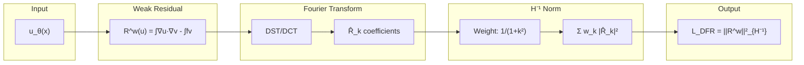

# Deep Fourier Residual (DFR) Method

The Deep Fourier Residual method is a variational approach that uses Fourier basis functions to compute the $H^{-1}$ dual norm of the PDE residual.

## Motivation

In standard PINNs, the loss function is:

$$
\mathcal{L}(u) = \|\mathcal{R}(u)\|_{L^2}^2
$$

However, the $L^2$ norm of the residual may not be equivalent to the error norm. For well-posed problems, the **dual norm** provides this equivalence:

$$
\frac{1}{M}\|\mathcal{R}(u)\|_{V^*} \leq \|u - u^*\|_U \leq \frac{1}{\gamma}\|\mathcal{R}(u)\|_{V^*}
$$

## Weak Formulation

For Poisson's equation with homogeneous Dirichlet BCs, the weak form is:

$$
\langle \mathcal{R}^w(u), v \rangle = \int_\Omega \nabla u \cdot \nabla v \, dx - \int_\Omega f v \, dx = 0 \quad \forall v \in H^1_0(\Omega)
$$

The residual $\mathcal{R}^w(u)$ lives in $H^{-1}(\Omega) = [H^1_0(\Omega)]^*$.

## The Dual Norm

The dual norm is defined as:

$$
\|\mathcal{R}^w(u)\|_{H^{-1}} = \sup_{v \in H^1_0 \setminus \{0\}} \frac{|\langle \mathcal{R}^w(u), v \rangle|}{\|v\|_{H^1}}
$$

Computing this exactly requires solving an auxiliary problem. The DFR method uses Fourier analysis to **efficiently approximate** this norm.

## Fourier Representation

On rectangular domains with appropriate boundary conditions, the $H^{-1}$ norm can be computed using the Discrete Sine Transform (DST) and Discrete Cosine Transform (DCT).

For $\Omega = [0, L]$ with homogeneous Dirichlet BCs, if:

$$
R(x) = \sum_{k=1}^{N} \hat{R}_k \sin\left(\frac{k\pi x}{L}\right)
$$

then:

$$
\|R\|_{H^{-1}}^2 = \sum_{k=1}^{N} \frac{\hat{R}_k^2}{1 + (k\pi/L)^2}
$$

## DFR Loss Function

The DFR loss is:

$$
\mathcal{L}_{\text{DFR}}(u) = \|\mathcal{R}^w(u)\|_{H^{-1}}^2
$$

This is computed as:

1. **Evaluate** the weak residual at quadrature points
2. **Transform** using DST to get Fourier coefficients
3. **Weight** by $(1 + k^2)^{-1}$ factors
4. **Sum** to get the squared $H^{-1}$ norm



## Implementation

```python
import torch
import torch.nn as nn
from torch import Tensor
from torch.fft import dst

def weak_residual(
    model: nn.Module,
    x: Tensor,
    dv_dx: Tensor,
    v: Tensor,
    f: Tensor,
    quadrature_weights: Tensor,
) -> Tensor:
    """Compute weak residual: ∫∇u·∇v - ∫fv."""
    x.requires_grad_(True)
    u: Tensor = model(x)

    du_dx: Tensor = torch.autograd.grad(
        u, x, grad_outputs=torch.ones_like(u), create_graph=True
    )[0]

    # Integrate against test function derivatives
    integrand: Tensor = du_dx * dv_dx - f * v
    residual: Tensor = torch.sum(integrand * quadrature_weights)
    return residual

def compute_h_minus_1_norm(
    residual_coeffs: Tensor,
    modes: Tensor,
) -> Tensor:
    """Compute H⁻¹ norm using Fourier weighting."""
    weights: Tensor = 1.0 / (1.0 + modes ** 2)
    return torch.sum(weights * residual_coeffs ** 2)
```

## Boundary Condition Enforcement

DFR uses a **cutoff layer** to enforce homogeneous Dirichlet BCs:

$$
u(x) = x(L - x) \cdot \tilde{u}(x)
$$

This ensures $u(0) = u(L) = 0$ exactly, regardless of the network output.

## Advantages Over PINNs

| Aspect                     | PINNs              | DFR                |
| -------------------------- | ------------------ | ------------------ |
| **Loss-Error Correlation** | Weak               | Strong             |
| **Regularity Requirement** | $H^2$              | $H^1$              |
| **Error Estimation**       | Indirect           | Direct             |
| **Numerical Integration**  | Random collocation | Fourier quadrature |

## When to Use DFR

DFR is particularly advantageous when:

1. **Solutions lack $H^2$ regularity** (discontinuous coefficients)
2. **Accurate error estimation** is needed during training
3. **Point sources** or singular forcing terms are present
4. The problem has **large gradients** or boundary layers

## Limitations

- **Domain restriction**: Currently limited to rectangular domains
- **Boundary conditions**: Must be Dirichlet or Neumann on each face
- **Implementation complexity**: More involved than standard PINNs
- **Curse of dimensionality**: Requires $O(N^d)$ Fourier modes in $d$ dimensions

:::note Related work
The full tensor product of Fourier modes grows as $O(N^d)$ in dimension $d$. Sparse
tensor and hyperbolic-cross constructions reduce this for functions with bounded
mixed derivatives, and the original DFR authors list better basis choices as future
work. This project does not pursue that direction; it extends DFR toward
[goal-oriented error control](/docs/preprint) instead. The
[Background and Positioning](/docs/preprint/literature-review#how-this-project-is-scoped)
page discusses the trade-off.
:::

## Example: 1D Poisson with DFR

```python
import numpy as np
import torch
import torch.nn as nn
from torch import Tensor
from scipy.fft import dst

class DFRModel(nn.Module):
    """Neural network with cutoff layer for homogeneous Dirichlet BCs."""

    def __init__(self, network: nn.Module, domain_length: float = np.pi) -> None:
        super().__init__()
        self.network = network
        self.L: float = domain_length

    def forward(self, x: Tensor) -> Tensor:
        # Cutoff ensures u(0) = u(L) = 0
        cutoff: Tensor = x * (self.L - x)
        return cutoff * self.network(x)

def compute_dfr_loss(
    model: nn.Module,
    x_quad: Tensor,
    fourier_modes: Tensor,
    f: Tensor,
    quadrature_weights: Tensor,
) -> Tensor:
    """Compute DFR loss as H⁻¹ norm of weak residual."""
    x_quad.requires_grad_(True)
    u: Tensor = model(x_quad)

    du_dx: Tensor = torch.autograd.grad(
        u, x_quad, grad_outputs=torch.ones_like(u), create_graph=True
    )[0]

    # Weak residual at quadrature points
    weak_res: Tensor = du_dx - f  # Simplified for illustration

    # Apply DST to get Fourier coefficients
    coeffs: Tensor = torch.fft.dst(weak_res, type=1)

    # Compute H⁻¹ norm with Fourier weighting
    weights: Tensor = 1.0 / (1.0 + fourier_modes ** 2)
    h_minus_1_norm_sq: Tensor = torch.sum(weights * coeffs ** 2)

    return h_minus_1_norm_sq
```

## References

- [Taylor, Pardo, Muga (2022)](https://arxiv.org/abs/2210.14129) - Original DFR paper
- [Kharazmi et al. (2019)](https://arxiv.org/abs/1912.00873) - VPINNs
