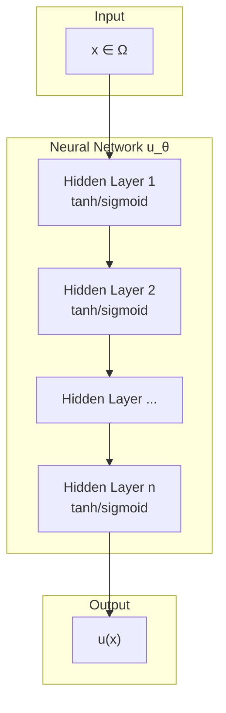
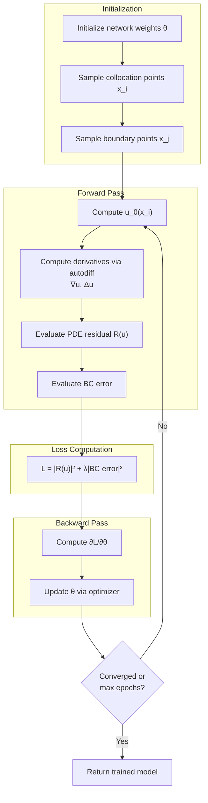

# Physics-Informed Neural Networks (PINNs)

Physics-Informed Neural Networks embed physical laws directly into the neural network training process through the loss function.

## Core Concept

Given a PDE of the form:

$$
\mathcal{R}(u) = 0 \quad \text{in } \Omega
$$

with boundary conditions, PINNs approximate the solution $u$ using a neural network $u_\theta$ and minimize a loss function that penalizes:

1. **PDE residual** at collocation points
2. **Boundary condition violations**

## Mathematical Formulation

### Strong Form

For Poisson's equation:

$$
-\Delta u(x) = f(x) \quad \text{in } \Omega
$$

with Dirichlet boundary conditions $u|_{\partial\Omega} = g$, where $g: \partial\Omega \to \mathbb{R}$ is the prescribed boundary data (often $g = 0$ for homogeneous BCs).

### Loss Function

The PINNs loss is typically:

$$
\mathcal{L}(\theta) = \underbrace{\frac{1}{N_r}\sum_{i=1}^{N_r} |\mathcal{R}(u_\theta)(x_i)|^2}_{\text{PDE residual}} + \lambda \underbrace{\frac{1}{N_b}\sum_{j=1}^{N_b} |u_\theta(x_j) - g(x_j)|^2}_{\text{BC penalty}}
$$

where:
- $\{x_i\}_{i=1}^{N_r}$ are interior collocation points
- $\{x_j\}_{j=1}^{N_b}$ are boundary points
- $\lambda$ is a penalty parameter

## Architecture

A typical PINNs architecture consists of a feedforward neural network:



For enforcing homogeneous Dirichlet BCs, a cutoff function approach multiplies the network output:

$$
u(x) = \phi(x) \cdot \tilde{u}(x)
$$

where $\phi(x) = 0$ on $\partial\Omega$.

### Training Loop



## Automatic Differentiation

The key enabler for PINNs is automatic differentiation (autodiff), which computes exact derivatives of the network output with respect to inputs:

```python
import torch
from torch import Tensor

def compute_derivatives(u: Tensor, x: Tensor) -> tuple[Tensor, Tensor]:
    """Compute first and second derivatives using autodiff."""
    du_dx = torch.autograd.grad(
        u, x, grad_outputs=torch.ones_like(u), create_graph=True
    )[0]
    d2u_dx2 = torch.autograd.grad(
        du_dx, x, grad_outputs=torch.ones_like(du_dx), create_graph=True
    )[0]
    return du_dx, d2u_dx2
```

## Advantages

- **Mesh-free**: No discretization required
- **Flexible**: Handles complex geometries
- **High-dimensional (vs FEM)**: Scales better than traditional FEM for $d > 3$ since FEM meshes grow as $O(N^d)$, while PINNs uses random collocation

:::caution
While PINNs scales better than FEM in high dimensions, it still has limitations:
- Weak loss-error correlation (L² loss ≠ error norm)
- Requires H² regularity

The [DFR method](/docs/theory/dfr) provides better error-loss equivalence, at the cost of a full tensor product of $O(N^d)$ Fourier modes on box domains. This project extends DFR toward [goal-oriented error control](/docs/preprint) rather than toward higher dimensions.
:::

## Limitations

- **Loss landscape**: Non-convex, may have spurious local minima
- **Training cost**: Can require many iterations
- **Accuracy**: Loss doesn't directly correspond to error norm
- **Regularity**: Strong formulation requires $u \in H^2$

## Example: 1D Poisson

Consider:

$$
u''(x) + 4\sin(2x) = 0, \quad x \in [0, \pi]
$$

with $u(0) = u(\pi) = 0$. The exact solution is $u(x) = \sin(2x)$.

```python
import torch
import torch.nn as nn
from torch import Tensor

def pde_residual(model: nn.Module, x: Tensor) -> Tensor:
    """Compute the PDE residual: u'' + 4*sin(2x) = 0."""
    x.requires_grad_(True)
    u = model(x)

    # First derivative
    du_dx = torch.autograd.grad(
        u, x, grad_outputs=torch.ones_like(u), create_graph=True
    )[0]

    # Second derivative
    d2u_dx2 = torch.autograd.grad(
        du_dx, x, grad_outputs=torch.ones_like(du_dx), create_graph=True
    )[0]

    f = 4 * torch.sin(2 * x)
    return d2u_dx2 + f

def compute_loss(model: nn.Module, x_interior: Tensor) -> Tensor:
    """Compute PINNs loss as mean squared residual."""
    residual = pde_residual(model, x_interior)
    return torch.mean(residual ** 2)
```

## See Also

- [Deep Fourier Residual Method](/docs/theory/dfr) - Variational alternative
- [Method Comparison](/docs/theory/comparison) - When to use each approach
